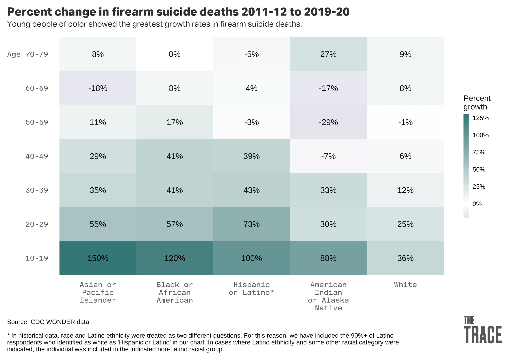
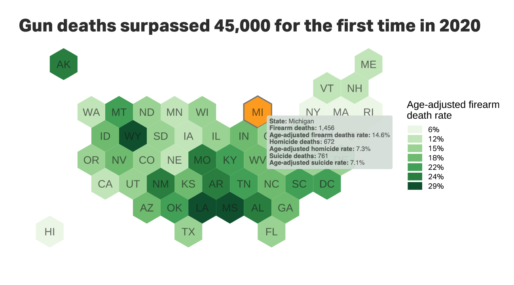

#### Load packages
```{r}
library(tidyverse)
library(babynames)
library(scales)
```

#### Load data
```{r}
data <- babynames
```

### What is ggplot2?

The package ggplot2 allows us to create a number of visualizations with tremendous flexibility and customization.  Because it is open source, its capabilities are expanded all the time by a community around the world.

### ggplot examples





### Making a bar chart

For this first chart, let's make a bar chart.

We'll start by getting our data ready.
```{r}
bar_chart_data <- data %>% filter(year == 2017) %>% top_n(10, n)
```

Now we want to make a plot.

First, let's create a blank canvas
```{r}
data %>% ggplot()
```

Now let's add x and y dimensions to our canvas.
```{r}
bar_chart_data %>% ggplot(aes(x = name, y = n)) 
```

Now we need to add something called a 'geom'. This determines what kind of chart will get added to our canvas.
```{r}
bar_chart_data %>% ggplot(aes(x = name, y = n)) +
  geom_col()

```

This is not really how we want this to look. First, let's order the bars by n.

```{r}
bar_chart_data %>% ggplot(aes(x = reorder(name,desc(n)), y = n)) +
  geom_col()
```

That's getting a bit better, but that color is hideous!

In R, we can use a selection of named colors, or any hex value.

```{r}
bar_chart_data %>% ggplot(aes(x = reorder(name,desc(n)), y = n)) +
  geom_col(fill = "cadetblue", alpha = .8)
```

Looking better, but I don't love the y-axis. Let's add commas to the tick mark labels.

```{r}
bar_chart_data %>% ggplot(aes(x = reorder(name,desc(n)), y = comma(n))) +
  geom_col(fill = "cadetblue", alpha = .8)
```

Now let's get rid of that ugly background, those axis labels, and add a title to our chart.

```{r}
bar_chart_data %>% ggplot(aes(x = reorder(name,desc(n)), y = comma(n))) +
  geom_col(fill = "cadetblue", alpha = .8) +
  labs(title = "The 10 most common baby names in 2017", subtitle = "None of these are Heaven spelled backwards.") +
  theme_minimal() +
  theme(axis.title = element_blank())
```

We can even layer geoms.

```{r}
bar_chart_data %>% ggplot(aes(x = reorder(name,desc(n)), y = comma(n))) +
  geom_col(fill = "cadetblue", alpha = .8) +
  labs(title = "The 10 most common baby names in 2017", subtitle = "None of these are Heaven spelled backwards.", caption = "Source: Social Security Administration\nby Olga Pierce") +
  theme_minimal() +
  theme(axis.title = element_blank(),
        axis.text.y = element_blank(),
        panel.grid.major = element_blank(),
        panel.grid.minor = element_blank()) +
geom_text(aes(label = comma(n)), vjust = -0.5)
```

Some of these are characterized as male names and some as female.  What if we want to color code them?

```{r}
bar_chart_data %>% ggplot(aes(x = reorder(name,desc(n)), y = comma(n), fill = sex)) +
  geom_col(alpha = .8) +
  labs(title = "The 10 most common baby names in 2017", subtitle = "None of these are Heaven spelled backwards.", caption = "Source: Social Security Administration\nby Olga Pierce") +
  theme_minimal() +
  theme(axis.title = element_blank(),
        axis.text.y = element_blank(),
        panel.grid.major = element_blank(),
        panel.grid.minor = element_blank()) +
geom_text(aes(label = comma(n)), vjust = -0.5)
```

Those colors are kinda problematic, let's pick our own.
```{r}
bar_chart_data %>% ggplot(aes(x = reorder(name,desc(n)), y = comma(n), fill = sex)) +
  geom_col(alpha = .8) +
  labs(title = "The 10 most common baby names in 2017", subtitle = "None of these are Heaven spelled backwards.", caption = "Source: Social Security Administration\nby Olga Pierce") +
  theme_minimal() +
  theme(axis.title = element_blank(),
        axis.text.y = element_blank(),
        panel.grid.major = element_blank(),
        panel.grid.minor = element_blank()) +
geom_text(aes(label = comma(n)), vjust = -0.5) +
scale_fill_manual(values=c("#756bb1", "#2ca25f"))
```
Now you try: With a buddy, make your own super awesome bar chart
```{r}

```

### Let's make a line chart
 
First, we want to get the 10 girls' names.
```{r}
line_chart_data <- data %>% filter(sex == "F" & name %in% c("Olive", "Betty", "Madison", "Nevaeh", "Stephanie"))

View(line_chart_data)
```

Now we'll set up our canvas
```{r}
line_chart_data %>% ggplot(aes(x = year, y = prop))
```

And now we'll add lines
```{r}
line_chart_data %>% ggplot(aes(x = year, y = prop, color = name)) +
  geom_line() +
  theme_minimal()
```

Let's do some cosmetic changes
```{r}
line_chart_data %>% ggplot(aes(x = year, y = prop, color = name)) +
  geom_line() +
  scale_y_continuous(labels = scales::percent) +
  scale_x_continuous(breaks = seq(1900,2017,10)) +
  theme_minimal() +
  theme(axis.title = element_blank()) +
  labs(title = "My awesome chart title", subtitle = "Names as a percentage of all births", color = "Baby name")
```

And here's an alternative version
```{r}
line_chart_data %>% ggplot(aes(x = year, y = prop, color = name, fill = name)) +
  geom_density(stat = "identity", alpha = .5) +
  theme_minimal()
```

#### Faceting

(Ignore this code - it's just to prep the data)
```{r}
top_names <- data %>% group_by(name) %>% summarize(total = sum(n)) %>% arrange(desc(total)) %>% top_n(20,total)

facet_names <- inner_join(data, top_names)
```


And now the chart
```{r}
facet_names %>% ggplot(aes(x = year, y = prop, color = name)) +
  geom_line() +
  scale_y_continuous(labels = scales::percent) +
  scale_x_continuous(breaks = seq(1900,2017,40)) +
  theme_minimal() +
  theme(legend.position = "none") +
  facet_wrap(vars(name), ncol = 5)
```

Your turn: With a buddy, make a rad line chart
```{r}

```

